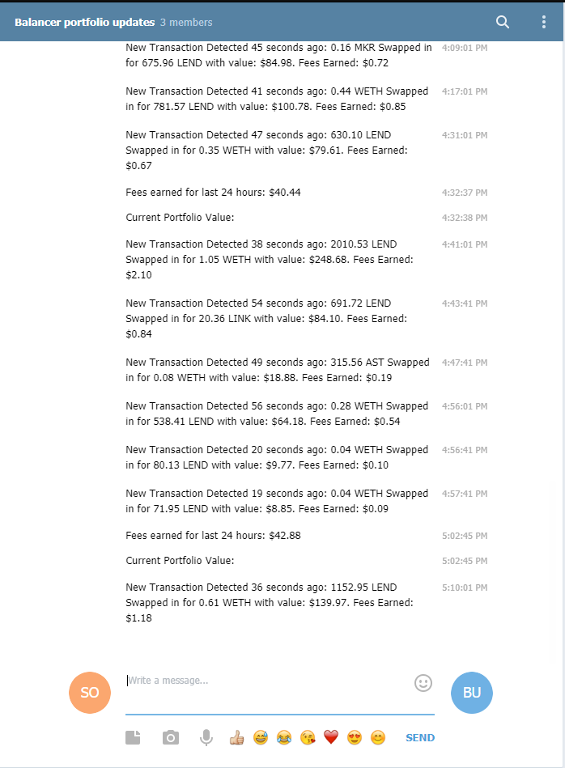

# Telegram bot for Balancer Pools

### Overview
Simple telegram bot that tracks one or more balancer pools. It will show transactions as they occur, and every 30 minutes display portfolio value and fees earned over last 24 hours.

Note: Requires NodeJS, axios, and node-telegram-bot-api to function.

### Example Output

### How to setup:
1. Set up your own bot with BotFather - https://telegram.me/BotFather
2. Create a keys.js that exports your bot token, or just set const token = 'your_bot_token' globally in index.js
3. run index.js in node (or host in a 3rd party service)
4. in a message to your bot, enter a balancer pool address and a wallet address that has shares of the pool.

example: 0x987D7Cc04652710b74Fff380403f5c02f82e290a 0xa524A07906cf5c3B7F90265CaB553388016cA385

this would start tracking the pool with an address of 0x987D7Cc04652710b74Fff380403f5c02f82e290a and use a wallet address of 0xa524A07906cf5c3B7F90265CaB553388016cA385 to calculate ownership percentage of the overall pool.

5. for multiple pools, repeat step 4. I'd recommend waiting about 15 seconds in between adding new pools since it is set to check each pool for new transactions every 60 seconds.

Note: The initial settings are to query the last 5 pool swaps, so in order for the 24h fee calculation to be accurate the bot has to run for 24 hours to gather all the transaction history needed. It will delete any transactions older than 24 hours.
